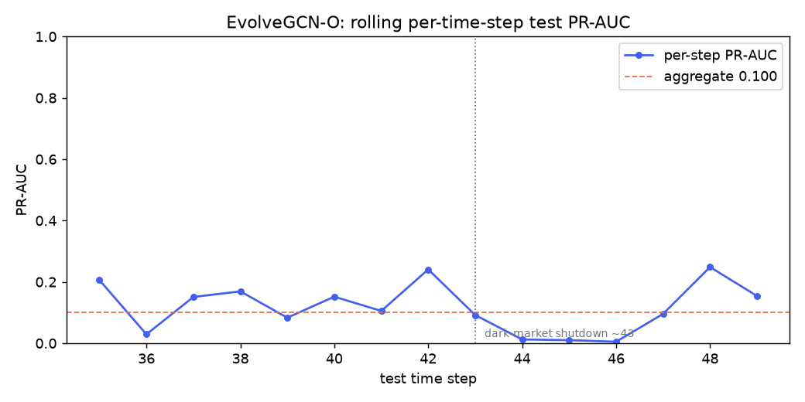
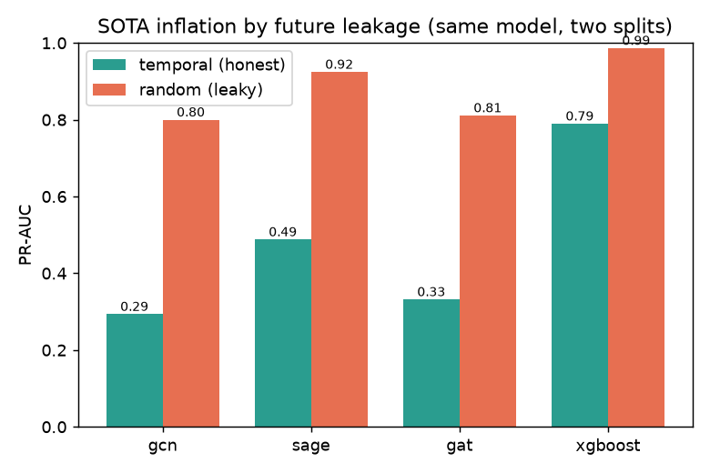
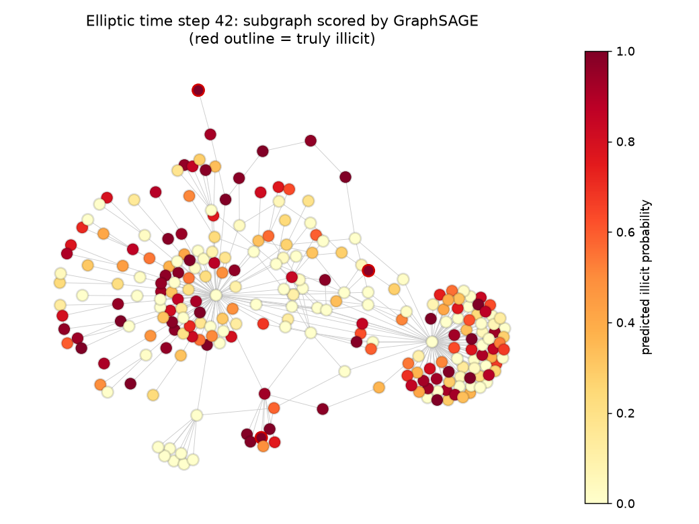

# gnn-fraud-onchain

**Fraud / anomaly detection on on-chain transaction graphs with Graph Neural Networks.**

A portfolio-grade, fully open and reproducible study: from non-graph baselines
(including an unsupervised autoencoder, a nod to [USAD](https://dl.acm.org/doi/10.1145/3394486.3403392))
to GNNs (GCN, GraphSAGE, GAT), a temporal variant, and a **heterogeneous /
relational** formulation aimed at the "one model across many schemas" question.

> Status: **complete; paper under review.** The study grew into a manuscript,
> *"How Much of the Elliptic Leaderboard Is Real? Decomposing Evaluation
> Inflation into Leakage, Shift, and Base-Rate Effects on Temporal Transaction
> Graphs"*, submitted to TMLR in July 2026 (source in
> [`paper/tmlr/`](paper/tmlr/)). Every number in the paper regenerates from this
> repo with a single seeded command. No result is reported until it is real and
> reproduced. See [`docs/loops/`](docs/loops/) for how this repo maintains itself.

## Why this project

Detecting illicit activity on a blockchain is naturally a **graph** problem:
accounts and transactions are nodes, value flows are edges, and fraud hides in
the *structure* (mixing patterns, peeling chains, fan-in/fan-out), not just in
per-node features. This repo learns that structure with GNNs and holds itself to
research-grade rigor: real public data with cited provenance, temporal
train/val/test splits (no leakage), and metrics that respect heavy class
imbalance (PR-AUC, minority-class F1).

## Roadmap

| Step | What | Status |
|------|------|--------|
| 0 | Scaffolding, green-gate, CI, agent playbook | done |
| 1 | Ingestion + graph EDA (Elliptic via PyTorch Geometric) | done |
| 2 | Baselines: LogReg / XGBoost + an unsupervised autoencoder (USAD nod) | done |
| 3 | GNNs: GCN -> GraphSAGE -> GAT (transductive) | done |
| 4 | Heterogeneous graph (Elliptic++) + relational-foundation-model framing | done |
| 5 | Write-up, model cards, demo (CLI subgraph scorer) | done |

## Data

Real, public data only, with provenance and license documented in
[`data/DATA_CARD.md`](data/DATA_CARD.md). The default pipeline uses the
**Elliptic Bitcoin** dataset packaged in PyTorch Geometric (no scraping);
the heterogeneous track uses **Elliptic++**. An optional extension ingests real
Ethereum data via official APIs (Etherscan / BigQuery), rate-limit-respecting,
with secrets kept in `.env` (never committed).

## Data at a glance (step 1 EDA)

Measured with `uv run --extra gnn gnn-fraud eda` on the PyG Elliptic build
(numbers, not estimates; see [`data/DATA_CARD.md`](data/DATA_CARD.md)):

- **203,769** transaction nodes, **234,355** edges, 165 features, directed.
- Labels: 42,019 licit / 4,545 illicit / 157,205 unknown -> only 46,564 labeled;
  illicit is **9.76% of labeled, 2.23% of all** (severe imbalance).
- Sparse and heavy-tailed: mean degree 2.30, max 473, zero isolated nodes.
- **49 connected components for 49 time steps**: edges barely cross time, so the
  graph is nearly a disjoint union of per-time-step subgraphs.

| Class imbalance | Degree (heavy-tailed) | Activity over time |
|---|---|---|
|  |  |  |

The temporal panel shows the built-in train/test boundary and the sharp drop in
illicit activity after a dark-market shutdown (~step 43) - exactly the kind of
distribution shift a temporal split must respect and a random split would hide.

## Results so far (step 2 baselines)

Non-graph reference on node features, evaluated on the **temporal** test split
(reproduce with `uv run --extra gnn --extra boost gnn-fraud baselines`; raw
numbers in [`docs/results/baselines.json`](docs/results/baselines.json)):

| Model | PR-AUC | ROC-AUC | F1 (illicit) | Precision | Recall |
|---|---|---|---|---|---|
| Logistic regression | 0.288 | 0.881 | 0.351 | 0.235 | 0.693 |
| **XGBoost** | **0.799** | 0.928 | **0.817** | 0.990 | 0.695 |
| Autoencoder (USAD-style) | 0.038 | 0.213 | 0.122 | 0.065 | 1.000 |


Reading these honestly:
- **XGBoost is the bar to beat** (PR-AUC 0.80). Note PR-AUC 0.80 vs ROC-AUC 0.93
  for the same model - ROC always looks rosier under imbalance, which is why
  PR-AUC is the primary metric here.
- **The unsupervised autoencoder fails (ROC-AUC 0.21, below random).** Trained on
  licit-only train nodes, it does *not* separate illicit at test time - illicit
  nodes actually reconstruct *better* than test-period licit ones. The most
  likely cause is **temporal distribution shift** (the licit "normal" learned on
  early time steps drifts after the dark-market shutdown), so feature-space
  reconstruction error stops tracking illicitness. This negative result is
  reported as-is; it is exactly the motivation for adding graph structure and
  temporal modeling (steps 3-4). A USAD-style adversarial refinement is a noted
  future variant, not a claim.

### Do GNNs beat the baseline? (step 3)

GCN, GraphSAGE and GAT, trained **transductively** on the full graph (unknown
nodes included for message passing), model-selected on a **temporal** validation
slice, evaluated on the same temporal test split (raw numbers in
[`docs/results/gnn.json`](docs/results/gnn.json)):

| Model | PR-AUC | ROC-AUC | F1 (illicit) |
|---|---|---|---|
| XGBoost (baseline) | **0.799** | 0.928 | **0.817** |
| GraphSAGE | 0.488 | 0.877 | 0.422 |
| GAT | 0.332 | 0.863 | 0.379 |
| GCN | 0.294 | 0.814 | 0.436 |
| Logistic regression (baseline) | 0.288 | 0.881 | 0.351 |


**Honest headline: vanilla GNNs do not beat XGBoost here** (best GNN, GraphSAGE,
0.49 vs 0.80 PR-AUC). This matches the literature (Weber et al., 2019, found
Random Forest > GCN on Elliptic). Why, concretely:
- The 165 node features already include **72 aggregated neighbor features**, so a
  lot of the graph signal is *already in the tabular input* that XGBoost sees.
- The graph is **disconnected per time step** (49 components ~ 49 steps), so 2-hop
  message passing only reaches same-step neighbors - a limited receptive field.
- **Temporal distribution shift** (the dark-market shutdown) hurts a model trained
  on early steps and tested on later ones; a transductive GNN has no temporal
  mechanism to adapt.

On PR-AUC the ordering is GraphSAGE > GAT > GCN, suggesting that separating self
from neighbor aggregation (SAGE) helps while attention does not (mean degree is only
2.3, so there is little for attention to weight). Honest caveat: the ordering is
metric-dependent - on illicit-F1 GCN (0.436) edges out SAGE (0.422) - and the GNN
temporal numbers carry seed noise of about +/-0.04-0.06 PR-AUC (see the multi-seed
table below), so we do not lean on fine-grained architecture rankings.

A note on XGBoost's two temporal numbers: 0.799 (this section) trains on the full
train period (steps 1-34, step-2 protocol); 0.791 +/- 0.001 (leakage/decomposition
experiments) trains on sub-train steps 1-29 with 30-34 held out as validation. The
difference is protocol, not tuning; both are reported.

### A temporal GNN: EvolveGCN-O (step 3b)

Since each transaction lives at one time step, a temporal model cannot track a
node over time; instead it can evolve its *weights* across the sequence of
snapshots. I implemented **EvolveGCN-O** (Pareja et al., AAAI 2020) from scratch
(a GRU evolves each GCN weight matrix; no fragile compiled deps) and trained it on
a strict temporal split (train steps 1-29, val 30-34, test 35-49).

| Model | PR-AUC | ROC-AUC | F1 (illicit) |
|---|---|---|---|
| EvolveGCN-O (strict temporal extrapolation) | 0.069 | 0.552 | 0.096 |

**This underperforms everything - and the honest reason is instructive.** A
diagnostic (train loss, val and test PR-AUC over epochs, across learning rates and
with/without gradient clipping) shows the training loss *decreases steadily* (the
model learns) and test PR-AUC stays low across every configuration we tried:
the committed lr x gradient-clipping sweep (`docs/results/evolvegcn_sweep.json`)
reaches val PR-AUC up to 0.459 and test PR-AUC at best **0.200**, still far below
every honest baseline. So this is not a training bug; it is a genuine failure to
generalize across the severe distribution shift (the dark-market shutdown around
step 43) when the weights are extrapolated far beyond the training window.

Two honest caveats before concluding anything about EvolveGCN:
- **It is a harder task than the static GNNs above**, which were *transductive*
  (test-node features participated in message passing). EvolveGCN here extrapolates
  in time with no access to the test period during training.
- The **standard EvolveGCN protocol is rolling** (train up to step t, predict step
  t+1), not one far-horizon split.

**Giving EvolveGCN a fair shot (rolling backtest).** With a fuller training budget
and a per-time-step rolling evaluation (`gnn-fraud backtest-temporal`), the aggregate
test PR-AUC rises only to **0.100** - still far below every other model. But the
per-time-step breakdown is the point: performance **collapses precisely at the
dark-market shutdown (steps 44-46: PR-AUC 0.012 / 0.010 / 0.005)** and partially
recovers after. So even with a fair protocol, EvolveGCN cannot handle the regime
change - and now we can *see* exactly where and why.



Bottom line at step 3: **XGBoost (PR-AUC 0.80) remains the bar**, and neither
static nor (strict-split) temporal GNNs beat it on Elliptic. No result is inflated;
each weak result is explained and points to the next experiment.

### Does relational structure help? Heterogeneous GNN on Elliptic++ (step 4)

[Elliptic++](https://github.com/git-disl/EllipticPlusPlus) (Elmougy & Liu, KDD '23)
adds **wallet addresses** on top of the transactions: a genuinely heterogeneous
graph with two node types (`tx`, `addr`) and four relations (tx-tx, addr-tx,
tx-addr, addr-addr; 822,942 addresses, 2.87M address-address edges). We classify
the **same transactions** as before (identical labels and temporal split, so it is
directly comparable) but now with address-level context, using a `HeteroConv`
GraphSAGE (one convolution per relation). See [`data/DATA_CARD.md`](data/DATA_CARD.md)
for provenance and the license note.

| Model | Graph | PR-AUC | ROC-AUC | F1 (illicit) |
|---|---|---|---|---|
| XGBoost (baseline) | none | **0.799** | 0.928 | 0.817 |
| **Heterogeneous SAGE** | **tx + addr (Elliptic++)** | **0.586** | 0.887 | 0.538 |
| GraphSAGE | tx-only (Elliptic) | 0.488 | 0.877 | 0.422 |
| GCN / GAT | tx-only | 0.29 / 0.33 | - | - |


**The relational structure helps - this is the headline positive result.** Adding
the address-level graph lifts the GNN from **0.488 to 0.586 PR-AUC (+20% relative)**,
the largest graph-driven gain in the project. It still does not beat XGBoost (0.80),
but the direction is unambiguous: **a richer relational schema yields a better graph
model.** That is exactly the thesis behind relational / "one model over many
schemas" approaches - the graph earns its keep once the schema is rich enough to
carry signal the tabular features miss. Honest caveats: the validation PR-AUC (0.96)
is far above test (0.59), so the temporal shift still bites; and address features
are mean-aggregated per address (a modeling choice, documented).

### Classifying actors, not just transactions (address-level task)

The same heterogeneous model, pointed at the **address** node type instead of `tx`
(`gnn-fraud train-hetero --target addr`), detects illicit **wallets** - a different,
arguably more actionable task (find the actors). On 92,451 test addresses (5.3%
illicit, split by first-seen time step) it scores **PR-AUC 0.456 / F1 0.529**
(seed 42, original lifetime feature protocol; under the deployment-honest
pre-split protocol the temporal arm averages 0.417 +/- 0.052 over 3 seeds),
catching 2,805 of 4,889 illicit addresses. The point is less the absolute number
than that **one schema-parameterized model serves both node types with no
architecture change** - the relational-foundation-model idea in practice.

## Quickstart

```bash
# 1. Install uv (https://docs.astral.sh/uv/), then:
uv sync                 # dev environment (lint/typecheck/test tooling)
uv sync --extra gnn     # add torch + torch-geometric (the graph stack)

# 2. Run the green-gate (what CI runs, locally, in seconds):
bash scripts/verify.sh          # lint + typecheck + tests + smoke CLI
bash scripts/verify.sh --full   # also the torch/PyG smoke train

# 3. Explore the CLI:
uv run gnn-fraud info
```

## Research findings (post-benchmark)

Beyond the benchmark: a verified literature review
([`docs/sota-review.md`](docs/sota-review.md)), an experiment log
([`docs/research-log.md`](docs/research-log.md)), and the resulting manuscript
([`paper/tmlr/main.tex`](paper/tmlr/main.tex), under review at TMLR):

- **Our honest results match the field's honest SOTA.** Under a strict temporal split
  and illicit-class F1 - the only comparable setting - tree ensembles (~0.80) beat
  GNNs by 10+ points, from Weber et al. 2019 to 2026. We reproduce that ordering.
- **The reported "~0.9-0.98 SOTA" is largely a protocol artifact.** Under a *random*
  split, **every model reaches "SOTA-looking" numbers** - XGBoost hits F1 0.955 /
  PR-AUC 0.987 (inside the literature's reported ~0.90-0.98 F1 band), GraphSAGE F1
  0.86 - then collapses under the honest temporal split. Same models, only the split
  changed. Over 5 seeds (mean +/- std):

  | Model | Temporal PR-AUC | Random PR-AUC | Inflation |
  |---|---|---|---|
  | GCN | 0.265 +/- 0.058 | 0.818 +/- 0.010 | +0.553 +/- 0.062 |
  | GraphSAGE | 0.510 +/- 0.039 | 0.920 +/- 0.008 | +0.410 +/- 0.046 |
  | GAT | 0.297 +/- 0.061 | 0.775 +/- 0.036 | +0.478 +/- 0.041 |
  | XGBoost | 0.791 +/- 0.002 | **0.986 +/- 0.001** | +0.195 +/- 0.001 |

  Every inflation is significant at the smallest attainable exact permutation
  level (p = 1/32), with 95% CIs bounded away from zero.

- **The published recipe, replicated exactly.** Following the full published recipe
  (stratified random split + aggregate metrics), a generic XGBoost reproduces the
  literature's headline numbers over 5 seeds: accuracy 0.9917 +/- 0.0002 and
  weighted F1 0.9916 +/- 0.0002, matching and slightly exceeding reported values
  such as 0.9802 / 0.9799. The same model under the temporal protocol scores
  illicit-F1 0.756 +/- 0.007. The protocol alone suffices to reach the band; no
  novel architecture is involved (`gnn-fraud recipe`;
  [`docs/results/recipe.json`](docs/results/recipe.json)).

- **Decomposed, the gap is mostly "distribution access" - and our own "double leak"
  hypothesis is refuted.** With a prevalence-matched control and an inductive
  ablation (all test nodes removed from the graph during training), the GraphSAGE
  gap splits into: base-rate **+0.026**, message-passing leakage **-0.000 +/- 0.008**
  (we hypothesized this graph-specific channel, measured it, and it is null), and
  **distribution access +0.384** - random splits train the model on the test
  period's distribution, an advantage no deployed model can have. The null holds
  for **all three architectures** (TOST 90% CIs bound the effect within +/-0.01
  for GraphSAGE, +/-0.03 for GCN, +/-0.05 for GAT). GNNs inflate more
  than XGBoost (paired GraphSAGE-XGBoost inflation difference +0.215, 95% CI
  [0.158, 0.272]) because they generalize worse across the temporal shift, not
  because of a graph leak (`gnn-fraud decompose`;
  [`docs/research-log.md`](docs/research-log.md)).

- **The mechanism makes a falsifiable prediction, and it holds.** If distribution
  access drives the inflation, it should concentrate where the shift is largest:
  the post-shutdown window. Splitting the test period (GraphSAGE, 5 seeds), the
  within-window random-over-temporal ratio rises from **1.4x pre-shutdown to 8.2x
  post-shutdown** (paired log-ratio +1.78 +/- 0.10, all five seeds positive,
  p = 1/32). Post-shutdown, the temporal model sits near the no-skill floor while
  the random-split model retains substantial skill - skill it can only have
  acquired by training on the post-shutdown period itself
  ([`docs/results/leakage_windowed.json`](docs/results/leakage_windowed.json)).

  

  **It generalizes to a second task, and cross-domain controls form a dose-response.**
  On Elliptic++ **address** classification (heterogeneous, 822k nodes) the same inflation
  appears and survives a deployment-honest feature protocol (pre-split wallet
  aggregation, train-only scaling): over 3 seeds, PR-AUC 0.417 +/- 0.052 (temporal)
  vs 0.965 +/- 0.002 (random), **+0.548 +/- 0.050**. On **DGraph-Fin**
  (3.7M-node fintech graph with a *temporally stable* fraud rate) the PR-AUC
  inflation vanishes (**+0.001 +/- 0.001** over 3 seeds) - though ROC-AUC still
  inflates (+0.025 +/- 0.006), and both models sit near the PR-AUC floor, so this
  control is supporting evidence rather than proof. On **IBM AMLworld HI-Small**
  (5.08M synthetic transactions, 0.102% laundering, *moderate* generator drift)
  the inflation is intermediate: **+0.124 +/- 0.007** (3 seeds), despite a
  base-rate effect running *against* it. Across four datasets the inflation thus
  tracks the drift magnitude - stable +0.001, moderate drift +0.124, regime change
  +0.41 to +0.55 - exactly what the distribution-access mechanism predicts
  ([`docs/results/leakage_amlworld.json`](docs/results/leakage_amlworld.json)).

- **The post-time-step-43 collapse is the real open problem** and is unsolved by any
  surveyed method under honest evaluation (our rolling backtest reproduces it). Four
  drift-robust variants fail honestly: three GraphUSAD versions (naive, rolling,
  domain-adversarial; ~0.04 PR-AUC, a first adaptation of USAD to graphs) and a
  supervised DANN-GraphSAGE. The DANN case is a documented self-correction: a
  single seed suggested it *hurt* (0.364); over 3 seeds it is indistinguishable
  from plain GraphSAGE (0.462 +/- 0.090 vs 0.510 +/- 0.039). Time-invariant
  representations do not solve the shift here, but they do not break anything
  either - the negative is reported with its uncertainty.

## Demo: score a real subgraph

`gnn-fraud demo` trains GraphSAGE on Elliptic, focuses on a test-period time step,
and renders a neighborhood around a genuinely illicit transaction - nodes colored
by the model's predicted illicit probability, truly-illicit nodes outlined in red.
It also prints the top flagged transactions. Everything shown is real (model,
scores, labels).

```bash
uv run --extra gnn gnn-fraud demo            # auto-picks the busiest illicit time step
uv run --extra gnn gnn-fraud demo --timestep 42
```



## Further reading

- [`docs/model-cards.md`](docs/model-cards.md) - one card per model, with metrics,
  intent, and limitations.
- [`docs/from-usad-to-gnns.md`](docs/from-usad-to-gnns.md) - the research narrative
  from USAD (KDD 2020) to relational graph learning.

## Reproducibility & engineering

- **Green-gate** (`scripts/verify.sh`): ruff + mypy + pytest + smoke, mirrored by
  GitHub Actions CI. Nothing merges on a red gate. *Fix the code, never the test.*
- **uv** for a locked, reproducible environment; fixed seeds; one YAML per experiment.
- **Docker** (`docker build -t gnn-fraud .`) for an OS-level reproducibility guarantee;
  a CI `docker` job smoke-runs the CLI in the image.
- **Agent playbook** in [`docs/loops/`](docs/loops/): how this repo is built and
  maintained with self-verifying Claude Code loops (plan -> implement ->
  adversarial self-review -> note).

## License

MIT - see [`LICENSE`](LICENSE).
