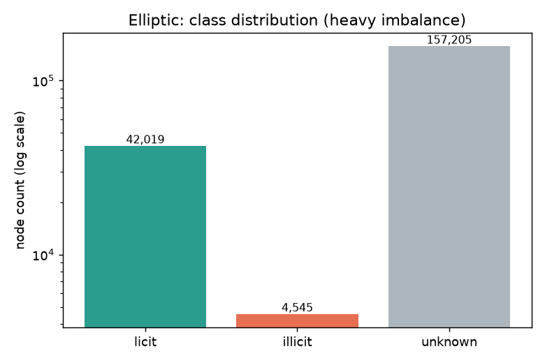
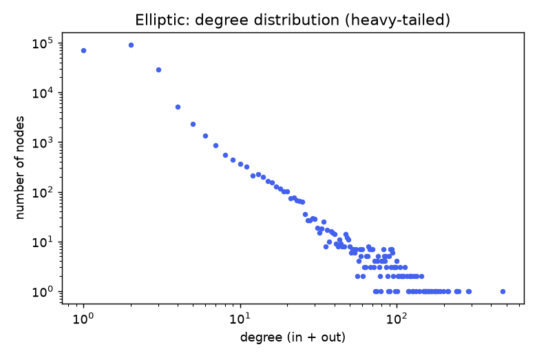
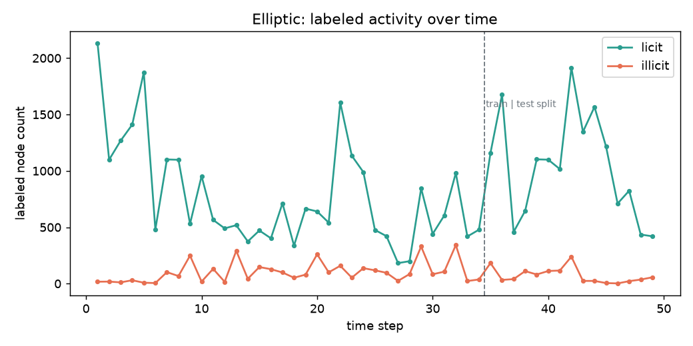
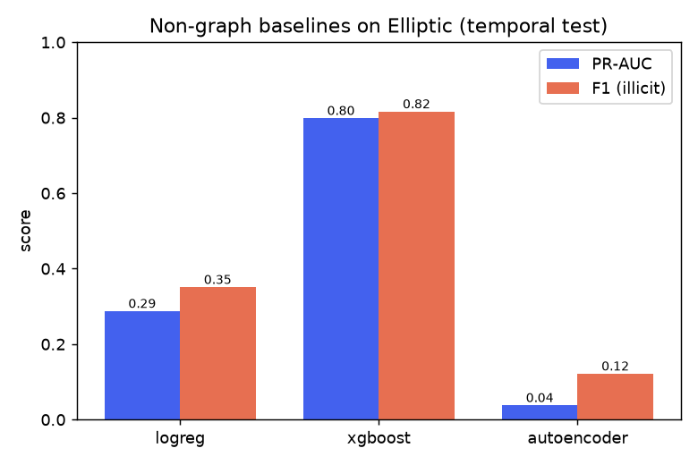
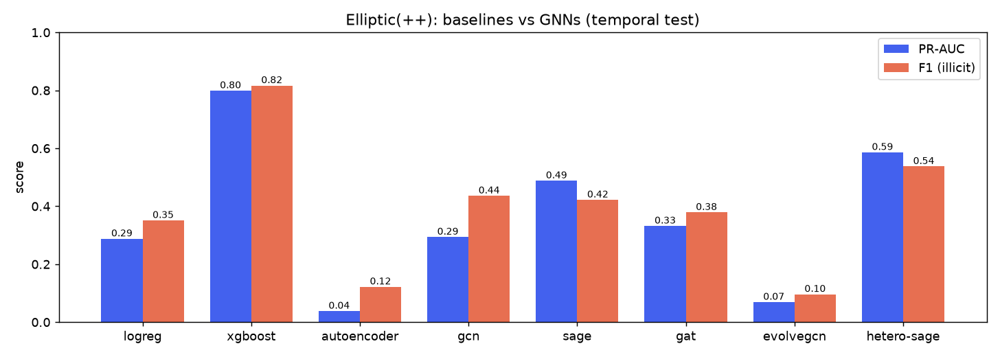

# gnn-fraud-onchain

**Fraud / anomaly detection on on-chain transaction graphs with Graph Neural Networks.**

A portfolio-grade, fully open and reproducible study: from non-graph baselines
(including an unsupervised autoencoder, a nod to [USAD](https://dl.acm.org/doi/10.1145/3394486.3403392))
to GNNs (GCN, GraphSAGE, GAT), a temporal variant, and a **heterogeneous /
relational** formulation aimed at the "one model across many schemas" question.

> Status: **step 0 - scaffolding.** The engineering loop (green-gate + CI +
> agent playbook) is in place; data, models and results land in the steps below.
> No result is reported until it is real and reproduced. See
> [`docs/loops/`](docs/loops/) for how this repo maintains itself.

## Why this project

Detecting illicit activity on a blockchain is naturally a **graph** problem:
accounts and transactions are nodes, value flows are edges, and fraud hides in
the *structure* (mixing patterns, peeling chains, fan-in/fan-out), not just in
per-node features. This repo learns that structure with GNNs and holds itself to
research-grade rigor: real public data with cited provenance, temporal
train/val/test splits (no leakage), and metrics that respect heavy class
imbalance (PR-AUC, minority-class F1).

## Roadmap

| Step | What | Status |
|------|------|--------|
| 0 | Scaffolding, green-gate, CI, agent playbook | done |
| 1 | Ingestion + graph EDA (Elliptic via PyTorch Geometric) | done |
| 2 | Baselines: LogReg / XGBoost + an unsupervised autoencoder (USAD nod) | done |
| 3 | GNNs: GCN -> GraphSAGE -> GAT (transductive) | done |
| 4 | Heterogeneous graph (Elliptic++) + relational-foundation-model framing | done |
| 5 | Rigorous evaluation, experiment tracking, demo (CLI / Streamlit) | todo |

## Data

Real, public data only, with provenance and license documented in
[`data/DATA_CARD.md`](data/DATA_CARD.md). The default pipeline uses the
**Elliptic Bitcoin** dataset packaged in PyTorch Geometric (no scraping);
the heterogeneous track uses **Elliptic++**. An optional extension ingests real
Ethereum data via official APIs (Etherscan / BigQuery), rate-limit-respecting,
with secrets kept in `.env` (never committed).

## Data at a glance (step 1 EDA)

Measured with `uv run --extra gnn gnn-fraud eda` on the PyG Elliptic build
(numbers, not estimates; see [`data/DATA_CARD.md`](data/DATA_CARD.md)):

- **203,769** transaction nodes, **234,355** edges, 165 features, directed.
- Labels: 42,019 licit / 4,545 illicit / 157,205 unknown -> only 46,564 labeled;
  illicit is **9.76% of labeled, 2.23% of all** (severe imbalance).
- Sparse and heavy-tailed: mean degree 2.30, max 473, zero isolated nodes.
- **49 connected components for 49 time steps**: edges barely cross time, so the
  graph is nearly a disjoint union of per-time-step subgraphs.

| Class imbalance | Degree (heavy-tailed) | Activity over time |
|---|---|---|
|  |  |  |

The temporal panel shows the built-in train/test boundary and the sharp drop in
illicit activity after a dark-market shutdown (~step 43) - exactly the kind of
distribution shift a temporal split must respect and a random split would hide.

## Results so far (step 2 baselines)

Non-graph reference on node features, evaluated on the **temporal** test split
(reproduce with `uv run --extra gnn --extra boost gnn-fraud baselines`; raw
numbers in [`docs/results/baselines.json`](docs/results/baselines.json)):

| Model | PR-AUC | ROC-AUC | F1 (illicit) | Precision | Recall |
|---|---|---|---|---|---|
| Logistic regression | 0.288 | 0.881 | 0.351 | 0.235 | 0.693 |
| **XGBoost** | **0.799** | 0.928 | **0.817** | 0.990 | 0.695 |
| Autoencoder (USAD-style) | 0.038 | 0.213 | 0.122 | 0.065 | 1.000 |



Reading these honestly:
- **XGBoost is the bar to beat** (PR-AUC 0.80). Note PR-AUC 0.80 vs ROC-AUC 0.93
  for the same model - ROC always looks rosier under imbalance, which is why
  PR-AUC is the primary metric here.
- **The unsupervised autoencoder fails (ROC-AUC 0.21, below random).** Trained on
  licit-only train nodes, it does *not* separate illicit at test time - illicit
  nodes actually reconstruct *better* than test-period licit ones. The most
  likely cause is **temporal distribution shift** (the licit "normal" learned on
  early time steps drifts after the dark-market shutdown), so feature-space
  reconstruction error stops tracking illicitness. This negative result is
  reported as-is; it is exactly the motivation for adding graph structure and
  temporal modeling (steps 3-4). A USAD-style adversarial refinement is a noted
  future variant, not a claim.

### Do GNNs beat the baseline? (step 3)

GCN, GraphSAGE and GAT, trained **transductively** on the full graph (unknown
nodes included for message passing), model-selected on a **temporal** validation
slice, evaluated on the same temporal test split (raw numbers in
[`docs/results/gnn.json`](docs/results/gnn.json)):

| Model | PR-AUC | ROC-AUC | F1 (illicit) |
|---|---|---|---|
| XGBoost (baseline) | **0.799** | 0.928 | **0.817** |
| GraphSAGE | 0.488 | 0.877 | 0.422 |
| GAT | 0.332 | 0.863 | 0.379 |
| GCN | 0.294 | 0.814 | 0.436 |
| Logistic regression (baseline) | 0.288 | 0.881 | 0.351 |



**Honest headline: vanilla GNNs do not beat XGBoost here** (best GNN, GraphSAGE,
0.49 vs 0.80 PR-AUC). This matches the literature (Weber et al., 2019, found
Random Forest > GCN on Elliptic). Why, concretely:
- The 165 node features already include **72 aggregated neighbor features**, so a
  lot of the graph signal is *already in the tabular input* that XGBoost sees.
- The graph is **disconnected per time step** (49 components ~ 49 steps), so 2-hop
  message passing only reaches same-step neighbors - a limited receptive field.
- **Temporal distribution shift** (the dark-market shutdown) hurts a model trained
  on early steps and tested on later ones; a transductive GNN has no temporal
  mechanism to adapt.

GraphSAGE > GCN > GAT is itself informative: separating self from neighbor
aggregation (SAGE) helped; attention (GAT) did not, likely because with a tiny
mean degree (2.3) there are too few neighbors for attention to matter.

### A temporal GNN: EvolveGCN-O (step 3b)

Since each transaction lives at one time step, a temporal model cannot track a
node over time; instead it can evolve its *weights* across the sequence of
snapshots. I implemented **EvolveGCN-O** (Pareja et al., AAAI 2020) from scratch
(a GRU evolves each GCN weight matrix; no fragile compiled deps) and trained it on
a strict temporal split (train steps 1-29, val 30-34, test 35-49).

| Model | PR-AUC | ROC-AUC | F1 (illicit) |
|---|---|---|---|
| EvolveGCN-O (strict temporal extrapolation) | 0.069 | 0.552 | 0.096 |

**This underperforms everything - and the honest reason is instructive.** A
diagnostic (train loss, val and test PR-AUC over epochs, across learning rates and
with/without gradient clipping) shows the training loss *decreases steadily* (the
model learns) and val PR-AUC reaches ~0.3, but **test PR-AUC collapses to ~0.1
regardless of tuning**. So this is not a training bug; it is a genuine failure to
generalize across the severe distribution shift (the dark-market shutdown around
step 43) when the weights are extrapolated far beyond the training window.

Two honest caveats before concluding anything about EvolveGCN:
- **It is a harder task than the static GNNs above**, which were *transductive*
  (test-node features participated in message passing). EvolveGCN here extrapolates
  in time with no access to the test period during training.
- The **standard EvolveGCN protocol is rolling** (train up to step t, predict step
  t+1), not one far-horizon split. A rolling evaluation is the natural next
  refinement and would give the temporal model a fair shot; the number above is the
  strict-split result, reported as-is.

Bottom line at step 3: **XGBoost (PR-AUC 0.80) remains the bar**, and neither
static nor (strict-split) temporal GNNs beat it on Elliptic. No result is inflated;
each weak result is explained and points to the next experiment.

### Does relational structure help? Heterogeneous GNN on Elliptic++ (step 4)

[Elliptic++](https://github.com/git-disl/EllipticPlusPlus) (Elmougy & Liu, KDD '23)
adds **wallet addresses** on top of the transactions: a genuinely heterogeneous
graph with two node types (`tx`, `addr`) and four relations (tx-tx, addr-tx,
tx-addr, addr-addr; 822,942 addresses, 2.87M address-address edges). We classify
the **same transactions** as before (identical labels and temporal split, so it is
directly comparable) but now with address-level context, using a `HeteroConv`
GraphSAGE (one convolution per relation). See [`data/DATA_CARD.md`](data/DATA_CARD.md)
for provenance and the license note.

| Model | Graph | PR-AUC | ROC-AUC | F1 (illicit) |
|---|---|---|---|---|
| XGBoost (baseline) | none | **0.799** | 0.928 | 0.817 |
| **Heterogeneous SAGE** | **tx + addr (Elliptic++)** | **0.586** | 0.887 | 0.538 |
| GraphSAGE | tx-only (Elliptic) | 0.488 | 0.877 | 0.422 |
| GCN / GAT | tx-only | 0.29 / 0.33 | - | - |


**The relational structure helps - this is the headline positive result.** Adding
the address-level graph lifts the GNN from **0.488 to 0.586 PR-AUC (+20% relative)**,
the largest graph-driven gain in the project. It still does not beat XGBoost (0.80),
but the direction is unambiguous: **a richer relational schema yields a better graph
model.** That is exactly the thesis behind relational / "one model over many
schemas" approaches - the graph earns its keep once the schema is rich enough to
carry signal the tabular features miss. Honest caveats: the validation PR-AUC (0.96)
is far above test (0.59), so the temporal shift still bites; and address features
are mean-aggregated per address (a modeling choice, documented). Next: a fair
rolling temporal protocol, and address-level classification on the same graph.

## Quickstart

```bash
# 1. Install uv (https://docs.astral.sh/uv/), then:
uv sync                 # dev environment (lint/typecheck/test tooling)
uv sync --extra gnn     # add torch + torch-geometric (the graph stack)

# 2. Run the green-gate (what CI runs, locally, in seconds):
bash scripts/verify.sh          # lint + typecheck + tests + smoke CLI
bash scripts/verify.sh --full   # also the torch/PyG smoke train

# 3. Explore the CLI:
uv run gnn-fraud info
```

## Reproducibility & engineering

- **Green-gate** (`scripts/verify.sh`): ruff + mypy + pytest + smoke, mirrored by
  GitHub Actions CI. Nothing merges on a red gate. *Fix the code, never the test.*
- **uv** for a locked, reproducible environment; fixed seeds; one YAML per experiment.
- **Agent playbook** in [`docs/loops/`](docs/loops/): how this repo is built and
  maintained with self-verifying Claude Code loops (plan -> implement ->
  adversarial self-review -> note).

## Learning in the open

- [`LEARNING_NOTES.md`](LEARNING_NOTES.md) - interview-ready notes on every concept
  (message passing, over-smoothing, heterogeneous/temporal graphs, imbalanced metrics).
- [`docs/from-usad-to-gnns.md`](docs/from-usad-to-gnns.md) - the narrative from
  temporal autoencoders (USAD, KDD 2020) to GNNs on relational / graph data.

## License

MIT - see [`LICENSE`](LICENSE).
